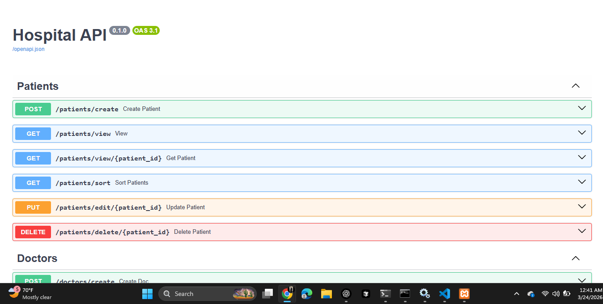
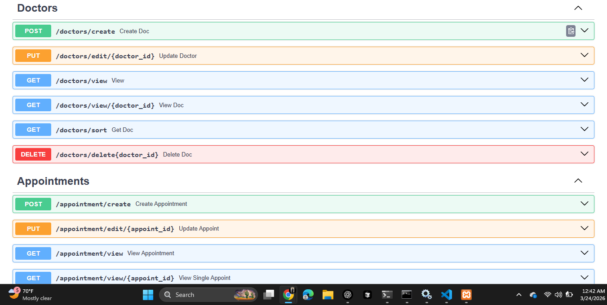

# Hospital Management API

## A fully functional and scalable `Hospital Management API` built using FastAPI (Python framework) for managing doctors, patients, and appointments.

This project help to manage hospital data like doctors, patients, and appointment. You can perform basic operations such as adding, viewing, updating, and deleting records. The data is stored in simple JSON files. The project uses modular routing to keep the code clean and organized.

- `main.py` Entry point of the application that runs the FastAPI server using Uvicorn.
- `routers` Handles modular API routes for doctors, patients, and appointments.
- `data` Stores application data in JSON files.

## Core Features

1. CRUD operation
2. Data validation with Pydantic
3. Storage in JSON
4. Modular routing

## Running the Project

Clone this repository to your local machine, open it in your preferred IDE, and then run the following command in your terminal:

```bash
uvicorn hospital_api.main:app --reload
```




## Author

Gohar Ayub
Computer Science Graduate
GitHub: https://github.com/goharayub7488
